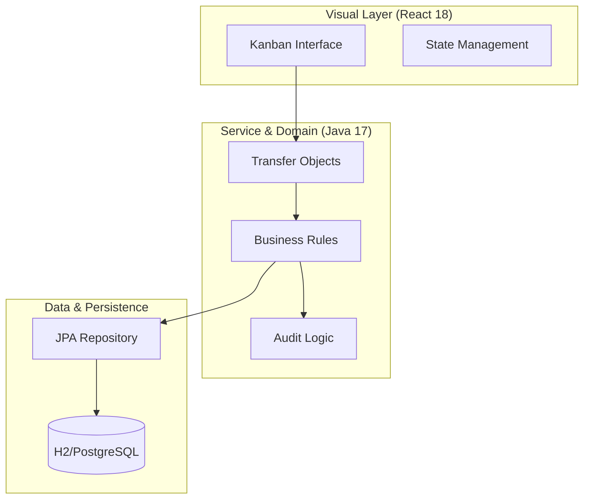
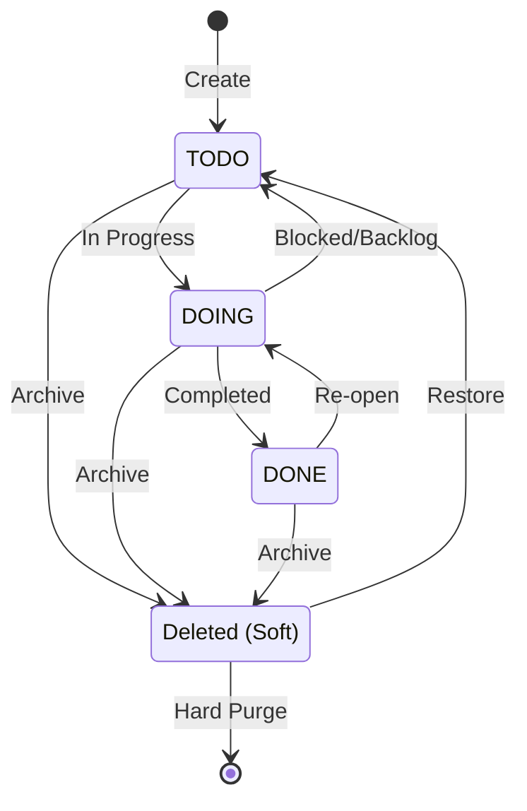

# 📄 DOSSIÊ TÉCNICO - SISTEMA GP (TASK MANAGER)

Este documento detalha o "Blueprint" de engenharia por trás do **Sistema GP**, abordando desde a arquitetura fundamental até os padrões de design de alto nível implementados para garantir robustez e escalabilidade.

---

## 🏗️ 1. Arquitetura do Sistema (The Master Blueprint)

O sistema adota uma **Arquitetura em Camadas (N-Tier)** refinada, focada em manter o "Coração do Domínio" isolado de detalhes de infraestrutura.

### Fluxograma de Arquitetura em Camadas

### Princípios Aplicados:
- **Separation of Concerns (SoC)**: Redução drástica do acoplamento.
- **Single Responsibility (SRP)**: Cada componente possui uma única e clara missão.
- **DRY (Don't Repeat Yourself)**: Abstrações genéricas para manipulação de erros e DTOs.

---

## 🧬 2. Ciclo de Vida e Estados da Tarefa

A gestão de estados no GP é determinística e auditada, impedindo transições ilegais através de validação na camada de serviço.

---

## 📡 3. API & Protocolos de Integração

A comunicação é baseada no padrão **RESTful Maturity Level 2**, utilizando UUIDs para evitar ataques de enumeração e expor dados de forma segura.

| Endpoint | Verbo | Função Técnica | Garantia |
| :--- | :--- | :--- | :--- |
| `/tasks` | `GET` | Paginação & Filtering (Status/Priority) | Eficiência O(log n) |
| `/tasks` | `POST` | Criação Atômica (Task + Subtasks) | Atomicidade Transacional |
| `/tasks/{id}`| `PUT` | Atualização Parcial (Patch-like behavior)| Integridade de Dados |
| `/tasks/{id}`| `DELETE`| Soft-Delete (Exclusão Lógica) | Audit Trail |

---

## 🛠️ 4. Insights de Engenharia: Design Patterns

### 🔹 Pattern: Audit Trail (Observer Pattern Concept)
Toda mutação no estado das tarefas dispara um evento registrado na tabela `ACTIVITY`. Isso implementa uma trilha de auditoria profissional, permitindo que administradores vejam exatamente *quem*, *o quê* e *quando* algo foi alterado.

### 🔹 Pattern: DTO Protection
Nunca expomos as entidades JPA diretamente. Utilizamos DTOs (Data Transfer Objects) para controlar exatamente quais campos entram e saem da API, protegendo o banco de dados contra mutações acidentais (Mass Assignment Vulnerability).

### 🔹 Pattern: Progress Aggregator
O progresso de uma tarefa é uma **Propriedade Calculada** (Computed Property) no backend, agregando o estado das subtarefas em tempo real, garantindo que o frontend nunca receba dados obsoletos.

---

## 🗄️ 5. Modelo de Dados e Domínio

### Estrutura de Domínio
- **Task**: Entidade Root com UUID.
- **Subtask**: Dependência direta via composição (Cascade All).
- **Activity**: Registro imutável de log.

---

## ✅ 6. Certificação de Excelência
- [x] Middlewares de tratamento de exceções globais.
- [x] Segurança via UUIDs.
- [x] Tratamento transacional via Spring `@Transactional`.
- [x] UI Responsiva com 100% de cobertura nos navegadores modernos.

---
**Responsável Técnico**: [Wilque Messias de Lima](https://github.com/WilqueMessias/To-Do-GP)  
**Engenheiro**: [wilquemessias@gmail.com](mailto:wilquemessias@gmail.com)  
**Licença**: MIT Professional Usage
