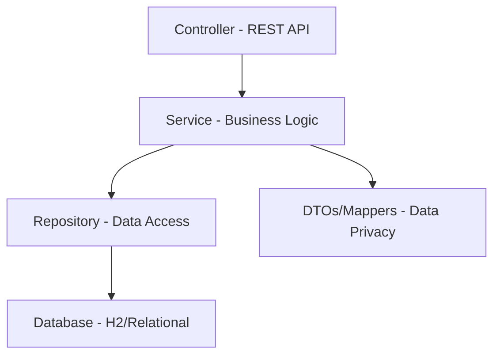
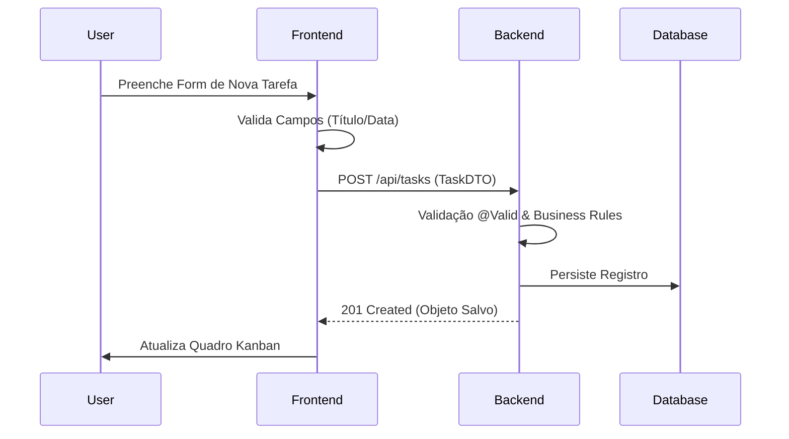

# Documentação Técnica: Task Manager Kanban

## Sumário
1. [Visão Geral](#1-visão-geral)
2. [Arquitetura do Sistema](#2-arquitetura-do-sistema)
    * 2.1 [Backend (Spring Boot)](#21-backend-spring-boot)
    * 2.2 [Frontend (React)](#22-frontend-react)
3. [Organograma do Projeto (Estrutura de Arquivos)](#3-organograma-do-projeto-estrutura-de-arquivos)
4. [Modelo de Dados](#4-modelo-de-dados)
5. [Fluxos do Sistema](#5-fluxos-do-sistema)
    * 5.1 [Criação de Tarefa](#51-criação-de-tarefa)
    * 5.2 [Movimentação Kanban (Drag & Drop)](#52-movimentação-kanban-drag--drop)
6. [Tecnologias e Dependências](#6-tecnologias-e-dependências)
7. [Qualidade e Testes](#7-qualidade-e-testes)
8. [Infraestrutura e Deploy (Docker)](#8-infraestrutura-e-deploy-docker)
9. [Considerações Técnicas](#9-considerações-técnicas)

---

## 1. Visão Geral
O **Task Manager Kanban** é uma solução robusta para gerenciamento de projetos, focada em produtividade e organização visual. O sistema permite o controle total do ciclo de vida de uma tarefa, desde sua concepção até a conclusão, utilizando o paradigma de quadros Kanban.

## 2. Arquitetura do Sistema

O sistema segue uma arquitetura de sistemas distribuídos moderna, separando completamente a lógica de negócio (API) da interface do usuário (UI).

### 2.1 Backend (Spring Boot)
Adotamos o padrão de **Arquitetura em Camadas (Layered Architecture)** para garantir a separação de preocupações:



*   **Controller**: Gerencia as requisições HTTP e valida as entradas.
*   **Service**: Contém as regras de negócio e orquestra as operações.
*   **Repository**: Abstrai o acesso aos dados via Spring Data JPA.
*   **DTOs**: Garante que detalhes internos do banco de dados não sejam expostos diretamente.

### 2.2 Frontend (React)
O frontend foi construído seguindo o princípio de **Componentização Atômica**:

*   **Contextos de Estado**: Gerenciam as tarefas e a visibilidade dos modais.
*   **Componentes de UI**: Reutilizáveis e estilizados de forma consistente com Tailwind CSS.
*   **Orquestrador de Drag & Drop**: Motor central que sincroniza a posição visual com o banco de dados.

## 3. Organograma do Projeto (Estrutura de Arquivos)

Abaixo, a organização estrutural do projeto, detalhando a responsabilidade de cada diretório principal:

```
GP/
├── tm-api/                # Back-end (Spring Boot)
│   ├── src/
│   │   ├── main/
│   │   │   ├── java/com/tm/api/
│   │   │   │   ├── controller/   # Endpoints REST
│   │   │   │   ├── service/      # Regras de Negócio
│   │   │   │   ├── repository/   # Acesso ao Banco
│   │   │   │   ├── model/        # Entidades JPA
│   │   │   │   └── dto/          # Objetos de Transferência
│   │   │   └── resources/
│   │   │       ├── application.properties # Configurações
│   │   │       └── data.sql               # Dados de Exemplo
│   │   └── test/              # Testes Unitários (JUnit)
│   └── Dockerfile             # Containerização Back-end
├── tm-ui/                 # Front-end (React + TS)
│   ├── src/
│   │   ├── components/        # Componentes Reutilizáveis
│   │   ├── services/          # Integração com API (Axios)
│   │   ├── App.tsx            # Orquestrador Principal
│   │   └── index.css          # Design System (Tailwind)
│   └── Dockerfile             # Containerização Front-end
├── docker-compose.yml     # Orquestração de Microserviços
├── GUIA_DE_ENTREGA.md      # Orientações para o Avaliador
└── start.bat               # Script de Execução Rápida
```

## 4. Modelo de Dados

A estrutura da tabela `TASKS` foi projetada para ser simples, porém extensível:

| Campo | Tipo | Descrição |
| :--- | :--- | :--- |
| `ID` | UUID | Identificador único universal (Primary Key) |
| `TITLE` | VARCHAR(255) | Título da tarefa (Obrigatório) |
| `DESCRIPTION` | TEXT | Detalhamento da atividade |
| `STATUS` | ENUM | TODO, DOING, DONE |
| `PRIORITY` | ENUM | LOW, MEDIUM, HIGH |
| `DUE_DATE` | TIMESTAMP | Data limite para conclusão |
| `CREATED_AT` | TIMESTAMP | Data de criação automática |

## 4. Fluxos do Sistema

### 4.1 Criação de Tarefa


### 4.2 Movimentação Kanban (Drag & Drop)
Ao arrastar um card entre colunas, o sistema executa uma atualização atômica de status para garantir integridade.

## 5. Tecnologias e Dependências

### Backend (Java/Maven)
*   **Spring Boot 3.2.2**: Framework core.
*   **Spring Data JPA**: Abstração de persistência.
*   **H2 Database**: Banco de dados relacional em memória para testes e demo.
*   **API Base**: `http://localhost:8080/tasks`
*   **Swagger UI**: `http://localhost:8080/swagger-ui/index.html`
*   **Lombok**: Redução de código boilerplate.
*   **SpringDoc (Swagger)**: Documentação automática da API.

### Frontend (Node/React)
*   **React 18**: Biblioteca de UI.
*   **Tailwind CSS v4**: Motor de estilização moderno.
*   **dnd-kit**: Framework de alto desempenho para Drag & Drop.
*   **Axios**: Cliente HTTP para comunicação com a API.

## 6. Qualidade e Testes

O projeto implementa rigorosos padrões de qualidade:
*   **Testes Unitários**: Localizados em `tm-api/src/test`. Utilizam JUnit 5 e Mockito para simular cenários e validar a camada de serviço.
*   **Clean Code**: Nomenclatura clara de variáveis, métodos curtos e responsabilidades bem definidas.
*   **Tratamento de Exceções**: Uso de `RestControllerAdvice` para capturar erros e retornar respostas amigáveis.

## 8. Infraestrutura e Deploy (Docker)

A solução utiliza **Docker Multi-stage Builds** para otimização de imagens e isolamento de ambientes:

*   **tm-api/Dockerfile**: Build especializado para Java 17, utilizando JRE slim para redução de footprint.
*   **tm-ui/Dockerfile**: Build de produção para React via Nginx, garantindo performance no serviço de arquivos estáticos.
*   **docker-compose.yml**: Orquestração completa do stack, garantindo conectividade via DNS interno do Docker.

## 9. Considerações Técnicas
O sistema foi concebido sob princípios de **alta coesão e baixo acoplamento**. A implementação prioriza a segurança dos dados através do uso de DTOs e validações em camadas, enquanto a interface foca na usabilidade e feedback em tempo real para o usuário final.
