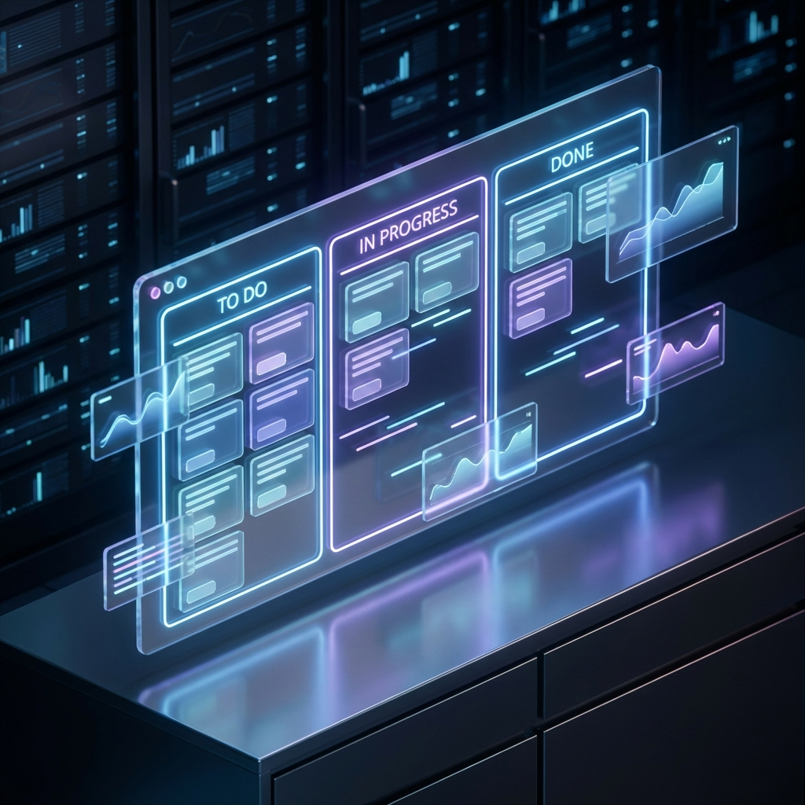

# To Do GP: Engineering & Architecture



<div align="center">

[](https://github.com/WilqueMessias)
[](https://br.linkedin.com/in/wilquemessias)

**To Do GP** is a decoupled task management system built with Java (Spring Boot) and TypeScript (React). It focuses on high-precision data auditing, real-time analytics, and persistent state management.

[Architecture & Technical Deep-Dive](./docs/ARCHITECTURE.md) · [Backend API (tm-api)](./tm-api/README.md) · [Frontend SPA (tm-ui)](./tm-ui/README.md)

</div>

---

## 🏗️ System Architecture


The system is designed following the **Separated Core** pattern, ensuring strict decoupling between the transactional backend and the reactive frontend.

- **Backend**: Implements the Business Logic, Immutable Audit Trail, and Persistence Layer.
- **Frontend**: Manages Optimistic State, UI Orchestration, and Real-time Analytics Calculations.

---

## 🏗️ Technical Highlights

Implementation focuses on non-functional requirements and distributed system patterns:

- **Asynchronous Event-Driven Auditing**: Decoupled activity logging using Spring Events and `@Async` execution.
- **API Resilience (Rate Limiting)**: Protective interceptors safeguarding backend resources.
- **Observability**: Specialized business KPI tracking via Micrometer and custom health probes.
- **Container Orchestration**: Docker-based deployment with integrated health-verification loops.

---

## 🛠️ Stack & Infrastructure

### Technical Core
| Tier | Technology | Rationale |
| :--- | :--- | :--- |
| **Backend** | Spring Boot 3.4.1 | Transactional integrity and automated dependency injection. |
| **Persistence** | Hibernate / JPA | Object-Relational Mapping (ORM) and abstraction of queries. |
| **Database** | H2 (Disk-Persistent) | Lightweight, SQL-compliant engine for rapid development. |
| **Frontend** | React 18 / Vite | Component-based UI with fast Hot Module Replacement. |
| **Styling** | Tailwind CSS v4 | Utility-first design system for optimized CSS delivery. |
| **Drag & Drop** | @dnd-kit | Physics-based interaction library with accessible sensors. |

---

## 🚀 Execution Environment

### Containerized Deployment (Docker)
```bash
docker-compose up --build
```
- **Interface**: [http://localhost](http://localhost)
- **API Spec**: [http://localhost:8080/swagger-ui.html](http://localhost:8080/swagger-ui.html)

### Native Windows Orchestrator
Execute `start.bat` for an interactive bootstrap menu.

---

## 📑 Detailed Navigation

- **[System Architecture](./docs/ARCHITECTURE.md)**: Diagrams for Entity Relationships, Components, and Operational Flows.
- **[Domain Model](./tm-api/src/main/java/com/tm/api/model/Task.java)**: Core entity implementation and logical state transitions.
- **[State Management](./tm-ui/src/hooks/useKanbanTasks.ts)**: Implementation details for optimistic UI updates.
- **[Auditing Implementation](./tm-api/src/main/java/com/tm/api/event/TaskAuditListener.java)**: Technical details of the asynchronous listener patterns.

---

## 🧬 Functional Metrics

- **Velocity Calculation**: Rolling count of tasks transitioned to `DONE` status within the last `168 hours`.
- **Cycle Time Analysis**: Arithmetic mean of `(completed_at - created_at)` for all terminal status tasks.
- **Delivery Rate**: Percentage distribution of terminal vs. non-terminal task states.

---
<div align="center">
Developed by Wilque Messias © 2026.
</div>
