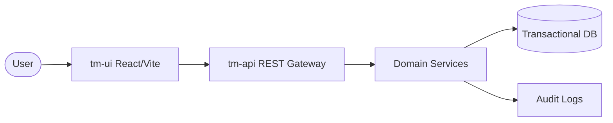

# 🚀 GP: Task Management Ecosystem

<div align="center">


**A high-performance, enterprise-ready Kanban system engineered for precision and scalability.**

[Explore Technical Dossier](./DOCUMENTAÇÃO_TÉCNICA.md) • [View Architecture](./DOCUMENTAÇÃO_TÉCNICA.md#1-arquitetura-do-sistema) • [Report Issue](https://github.com/WilqueMessias/To-Do-GP/issues)

</div>

---

## 💎 Project DNA

The **GP Ecosystem** is not just another task manager; it's a testament to professional software engineering. Designed with a **Domain-Driven** mindset and **Aesthetic-First** principles, it provides a seamless bridge between complex backend logic and a fluid, high-fidelity user interface.

### Why GP?
- **Cognitive Efficiency**: Minimalist yet powerful UI reduces mental load.
- **Data Integrity**: Transactional consistency and robust audit logs.
- **Professional Scalability**: Ready for microservices/containerized deployment.
- **Enterprise Grade**: Built-in Soft Delete, Restoration History, and Subtask Progress tracking.

---

## ⚡ Key Capabilities

| Feature | Description | Engineering Insight |
| :--- | :--- | :--- |
| **Advanced Kanban** | Dynamic drag-and-drop orchestration. | Optimized via `@dnd-kit` with zero-lag collision detection. |
| **Activity Audit** | Perpetual log of every state change. | Event-driven architecture for traceability. |
| **Subtask Engine** | Hierarchical task decomposition. | Real-time progress calculation on the service layer. |
| **Resilient History** | Soft-delete mechanism with full recovery. | Safety-first data management avoiding destructive operations. |
| **Analytics Suite** | Real-time productivity indicators. | Aggregated data views for executive decision-making. |

---

## 🛠️ Technology Stack (The Senior Choice)

### 🏗️ Backend Perfection
- **Core Engine**: Java 17 paired with **Spring Boot 3**.
- **Persistence**: Spring Data JPA with **H2/PostgreSQL** readiness.
- **API Contract**: Full **Swagger/OpenAPI** integration for developer self-service.
- **Quality**: Lombok for readability and Global Exception Handling for resilience.

### 🎨 Frontend Excellence
- **Runtime**: React 18 / TypeScript (Strict Mode).
- **Styling**: **Tailwind CSS v4** (Utility-first, performance-obsessed).
- **Interactions**: Lucide Icons & smooth micro-animations.
- **State**: Reactive UI with decoupled service consumption.

---

## 🚀 Deployment & Fast-Track

Experience the power of **GP** in seconds through our automated pipeline.

```bash
# Clone the repository
git clone https://github.com/WilqueMessias/To-Do-GP.git

# Launch the orchestrator
./start.bat  # Windows
sh start.sh  # Linux/Unix
```

> [!TIP]
> **Docker Desktop** is the recommended environment for zero-config execution.

---

## 📐 Architectural Overview



---

## 👨‍💻 Engineering & Authorship

This ecosystem was architected and developed by **Wilque Messias de Lima**, reflecting a commitment to code quality, architectural integrity, and user-centric design.

<div align="left">

- **Developer**: [Wilque Messias de Lima](https://github.com/WilqueMessias)
- **Portfolio**: [github.com/WilqueMessias](https://github.com/WilqueMessias)
- **Contact**: [wilquemessias@gmail.com](mailto:wilquemessias@gmail.com)
- **LinkedIn**: [Wilque Messias](https://br.linkedin.com/in/wilquemessias)

</div>

---

## 📄 License

Distributed under the **MIT License**. See `LICENSE` for more information.

---
**Developed with ❤️ and Engineering Passion by Wilque Messias.**
