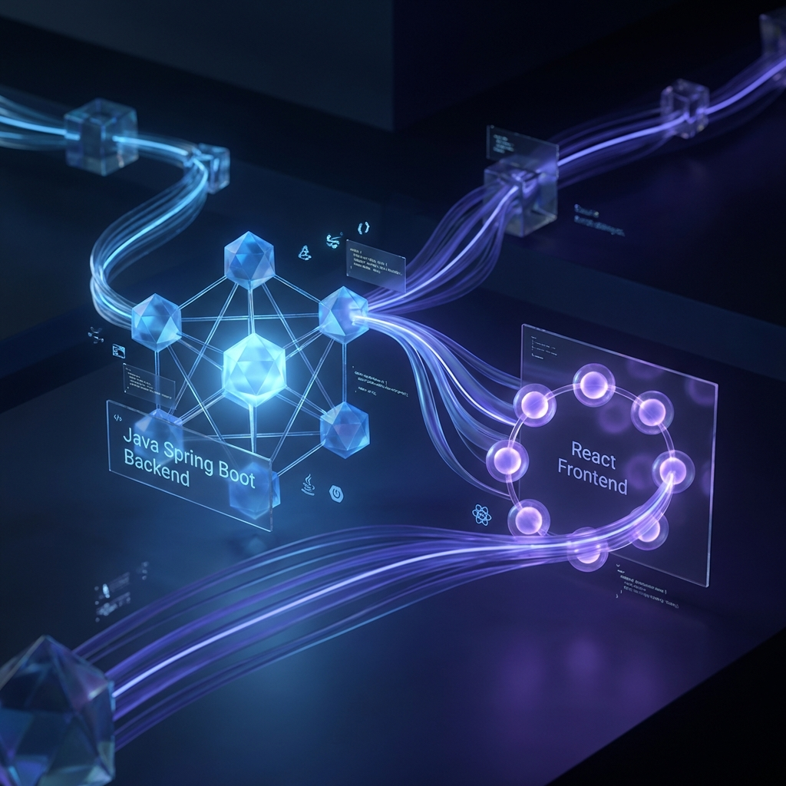
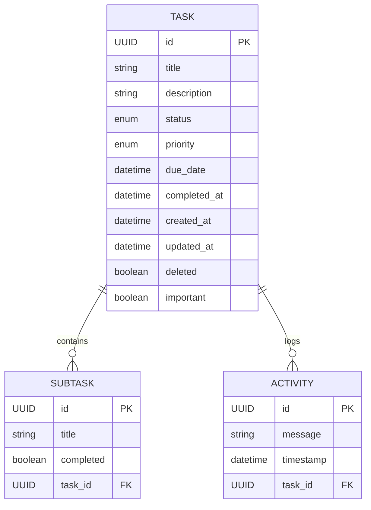
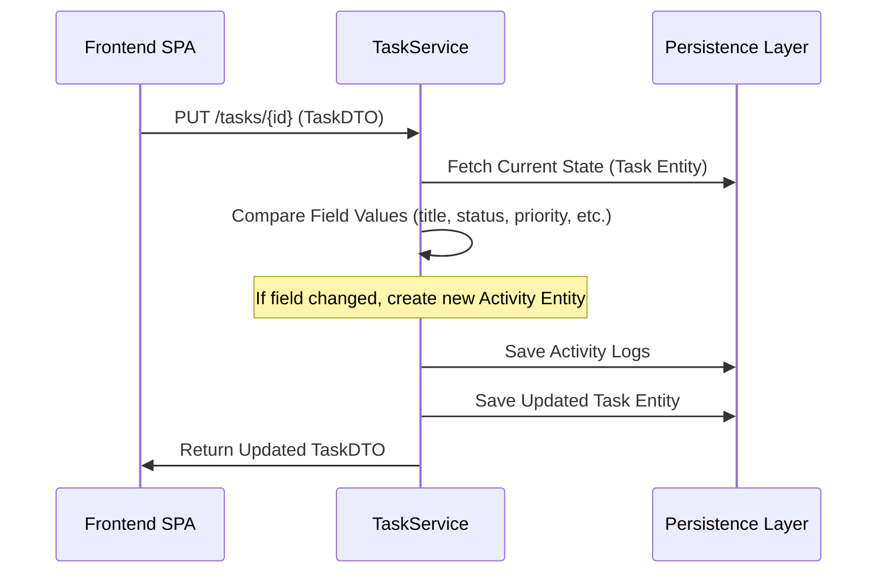

# Technical Documentation: To Do GP Implementation Details



## 🏛️ Component Architecture

The system operates as a distributed architecture with a clear separation between the stateful backend and the stateless (optimistic) frontend.

```mermaid
graph LR
    subgraph "Frontend Layer (React)"
        Store[useKanbanTasks Hook]
        UI[Kanban Board / Components]
        DND[@dnd-kit Orchestrator]
    end

    subgraph "Backend Layer (Spring Boot)"
        Controller[REST Controller]
        Service[TaskService / Audit Logic]
        Repo[JPA Repositories / Native SQL]
    end

    subgraph "Persistence Layer"
        DB[(H2 Database)]
    end

    UI <--> Store
    Store <--> DND
    Store -- "JSON DTO" --> Controller
    Controller <--> Service
    Service <--> Repo
    Repo <--> DB
```

---

## 🧬 Data Model (ER Diagram)

The persistence layer is managed by Hibernate/JPA, implementing a one-to-many relationship from the main `Task` entity to both `Subtask` and `Activity` logs.



---

## ⚙️ Core Operational Flows

### 1. Differential Audit Pattern
The system implements a manual "diffing" mechanism during entity updates to maintain an immutable audit trail.



### 2. Logical Deletion (Soft-Delete)
Persistence is managed via a logical flag to ensure history retention and instant restoration.
- **Logic**: `@SQLDelete(sql = "UPDATE tasks SET deleted = true WHERE id=?")`
- **Retention**: Filtered via `@SQLRestriction("deleted = false")` in normal operations.
- **Recovery**: Native SQL Bypass: `UPDATE tasks SET deleted = false WHERE id = :id`.

---

## 📡 API Topology (Operational)

### Endpoint Specification
| Method | Endpoint | Logic Complexity | Side Effects |
| :--- | :--- | :--- | :--- |
| `GET` | `/tasks` | O(1) | None |
| `POST` | `/tasks` | O(N) | Activity creation |
| `PUT` | `/tasks/{id}` | O(Diff * N) | Multiple Activity insertions |
| `DELETE` | `/tasks/{id}` | O(1) | Flag Toggle |
| `POST` | `/tasks/{id}/restore` | O(1) | Flag Toggle + Activity Log |

---

## 🖥️ Frontend State Orchestration

The UI utilizes **Optimistic Updates** to provide zero-latency interactions:
1. **Trigger**: User interacts with UI (e.g., drag card).
2. **Local State**: The `useKanbanTasks` hook updates the local task list immediately.
3. **Synchronization**: An asynchronous `PATCH/PUT` request is dispatched to the backend.
4. **Reconciliation**: On failure, the local state is rolled back; on success, it remains identical.

---
<div align="center">
Documented for Technical Review by Desenvolvedor.
</div>
