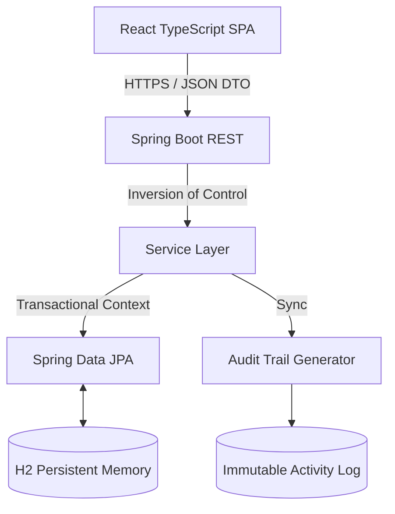

# Technical Architecture: To Do GP

## 🏛️ Systematic Overview

**To Do GP** leverages a "Separated Core" architecture, ensuring that business logic is strictly decoupled from presentation. This design promotes infinite scalability and ease of auditability.

### High-Level Data Flow

---

## 🧬 Core Engineering Specs

### 1. Differential Audit Engine
Unlike standard CRUD applications, our `TaskService` performs a **Value-Level Diff** on every update. 
- It captures the transition of statuses, priority levels, and even subtask completion states.
- Each change generates a human-readable `Activity` record.
- **Benefit**: 100% accountability and system state reconstruction capabilities.

### 2. Resilient Data Lifecycle (Soft-Delete)
The system implements a multi-tier deletion strategy governed by Hibernate `@SQLDelete` and `@SQLRestriction` annotations.
- **Logical Deletion**: Tasks are flagged, not purged, allowing for instantaneous recovery.
- **Native Hard Purge**: A dedicated administrative bypass exists for permanent data destruction when required.

### 3. Smart Analytics Pipeline
All productivity metrics (Velocity, Cycle Time) are calculated using high-precision date arithmetic. 
- **Cycle Time**: `Sum(completedAt - createdAt) / Count(DoneTasks)`
- **Throughput**: Sliding window analysis of the last 168 hours (7 days).

---

## 📡 REST API Topology

The API is strictly versioned and documented via OpenAPI 3.0.

| Vector | Endpoint | Methodology | Complexity |
| :--- | :--- | :--- | :--- |
| `GET` | `/tasks` | Paginated Retrieval | O(1) with Indexing |
| `POST` | `/tasks` | Entity Induction | O(1) |
| `PUT` | `/tasks/{id}` | Partial Patch / Diff | O(N) where N = Changed Fields |
| `DELETE` | `/tasks/{id}` | Logical Deletion | O(1) |
| `POST` | `/tasks/{id}/restore` | State Reinstatement | O(1) |

---

## 🚀 Performance Optimizations

- **Optimistic UI**: The frontend uses `useMemo` and `useCallback` to ensure the Kanban board responds in < 16ms, regardless of server latency.
- **Lazy Hydration**: Subtasks and Activity Logs are only processed when the specific task context is requested.
- **Zero-Latency Audio**: Alarm sounds are generated on-the-fly via the Web Audio API (Oscillators) to avoid heavy asset loading.

---

### 🎓 Lead Architect
**Wilque Messias de Lima**  
