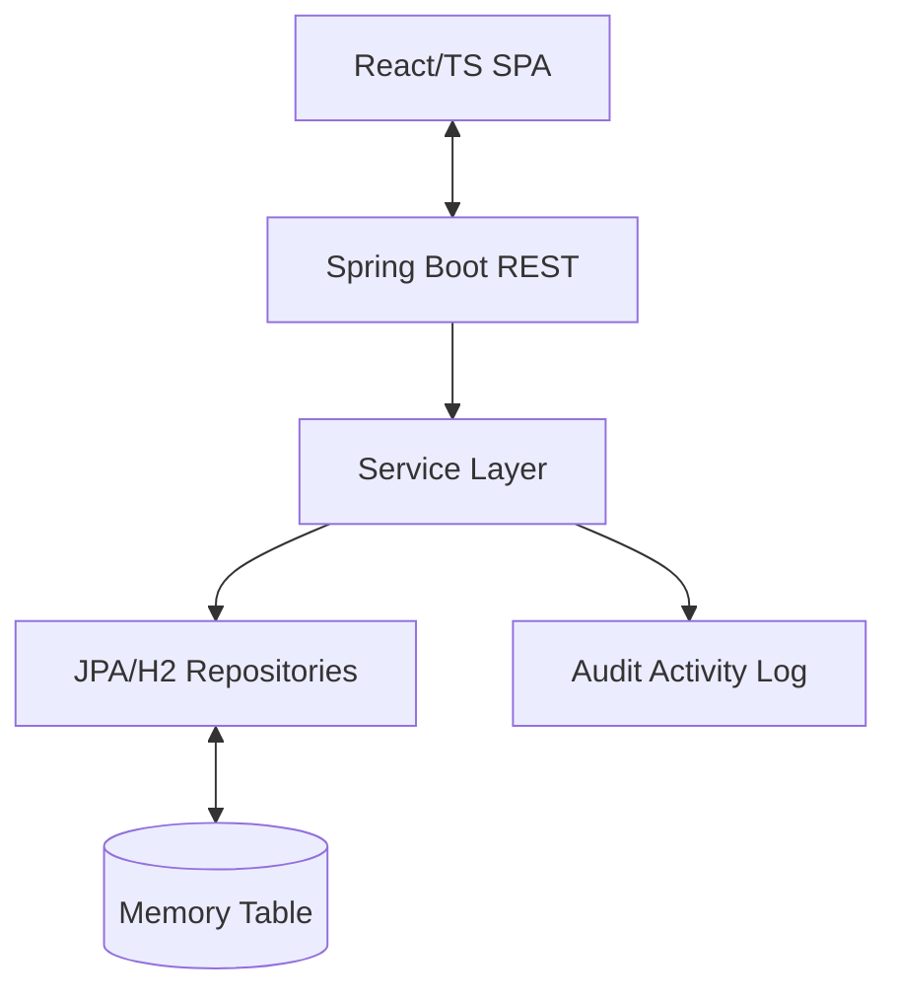

# TECHNICAL DOCUMENTATION: TO DO GP

## Architecture & Design

**To Do GP** is built on a modular "Separation of Concerns" architecture. The system is divided into a high-performance Java backend and a reactive TypeScript frontend.

### 🏗️ Data Flow Model

-   **Backend Layer**: Employs a transactional service layer that orchestrates domain rules, audit logging, and data persistence.
-   **Frontend Layer**: A component-based Single Page Application (SPA) that manages local state for responsive Drag & Drop interactions while synchronizing with the server asynchronously.

---

## 🧬 Data Lifecycle & Resilience

### 1. Soft Delete Mechanism
Unlike standard applications that perform destructive database operations, **To Do GP** implements a **Soft Delete** pattern.
-   Tasks are flagged as inactive rather than removed.
-   This allows for the **History & Restore** feature, where users can recover tasks mistakenly archived.
-   A separate "Hard Delete" endpoint is available for permanent database purging.

### 2. Audit Trail (Activity Log)
The backend automatically captures significant state transitions. Every `update` operation checks for differences in:
-   Status (e.g., TODO -> DOING)
-   Priority
-   Title/Description
-   Due Dates
-   Checklist completions

These are stored as immutable `Activity` records linked to the parent task, providing a full audit trail.

---

## 📡 API Specification

The REST API follows standardized conventions with idempotent operations where applicable.

| Verb | Endpoint | Description | Logic Detail |
| :--- | :--- | :--- | :--- |
| `GET` | `/tasks` | Paginated list | Supports status filtering and default sorting. |
| `POST` | `/tasks` | Creation | Initializes task state and creates the first activity log. |
| `PUT` | `/tasks/{id}` | Update | Performs differential analysis for audit logging. |
| `DELETE` | `/tasks/{id}` | Soft Delete | Transitions task to history. |
| `POST` | `/tasks/{id}/restore` | Restore | Resets deletion flag and logs restoration event. |

---

## 📊 Analytics Formulas

The **Analytics Dashboard** calculates productivity metrics in real-time on the client side:

-   **Delivery Rate**: `(Completed Tasks / Total Tasks) * 100`
-   **Average Cycle Time**: The mean time elapsed between a task's `createdAt` and `completedAt` timestamps (expressed in hours or minutes).
-   **Checklist Efficiency**: Total subtasks completed across all tasks divided by the total number of subtasks created.
-   **Velocity (7d)**: The absolute count of tasks moved to the `DONE` state within the last 7 sliding days.

---

## 🛠️ Internal Patterns

### DTO Projection
To protect the domain model and avoid "Mass Assignment" vulnerabilities, the API strictly communicates via `TaskDTO`. This ensures internal database entities (like audit triggers or internal IDs) are never exposed directly to the network.

### Drag & Drop Orchestration
The frontend uses the `@dnd-kit` library with **Pointer** and **Keyboard** sensors. State updates are optimistic to ensure zero-latency feel, with background synchronization to the backend.

---
**Lead Engineer**: [Wilque Messias de Lima](https://github.com/WilqueMessias)  
**Technical Contact**: wilquemessias@gmail.com  
**Version**: 1.0.0 (Homologated)
