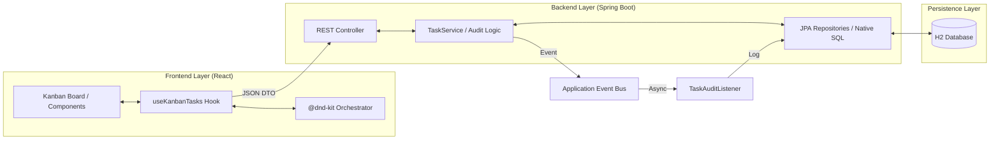
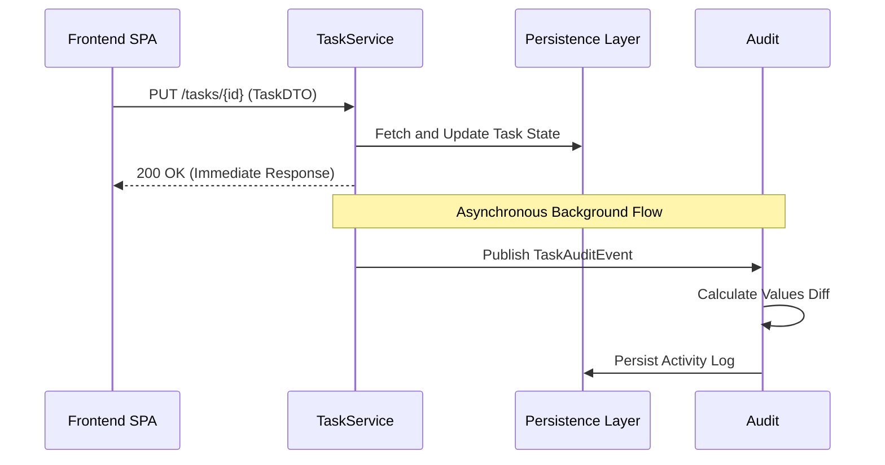

# Technical Documentation: To Do GP Implementation Details

## 🏛️ Component Architecture

The system operates as a distributed architecture with a clear separation between the stateful backend and the stateless (optimistic) frontend.

---

## 🧬 Data Model (ER Diagram)

The persistence layer is managed by Hibernate/JPA, implementing a one-to-many relationship from the main `Task` entity to both `Subtask` and `Activity` logs.

---

## ⚙️ Core Operational Flows

### 1. Differential Audit Pattern
The system implements a manual "diffing" mechanism during entity updates to maintain an immutable audit trail.

### 2. Logical Deletion (Soft-Delete)
Persistence is managed via a logical flag to ensure history retention and instant restoration.
- **Logic**: `@SQLDelete(sql = "UPDATE tasks SET deleted = true WHERE id=?")`
- **Retention**: Filtered via `@SQLRestriction("deleted = false")` in normal operations.
- **Recovery**: Native SQL Bypass: `UPDATE tasks SET deleted = false WHERE id = :id`.

---

## 📡 API Topology (Operational)

### Endpoint Specification
| Method | Endpoint | Logic Complexity | Side Effects |
| :--- | :--- | :--- | :--- |
| `GET` | `/tasks` | O(1) | None |
| `POST` | `/tasks` | O(N) | Activity creation |
| `PUT` | `/tasks/{id}` | O(Diff * N) | Multiple Activity insertions |
| `DELETE` | `/tasks/{id}` | O(1) | Flag Toggle |
| `POST` | `/tasks/{id}/restore` | O(1) | Flag Toggle + Async Event |

---

## 🛡️ Resilience & Engineering Excellence

### 1. Request Rate Limiting
To protect backend resources, the system implements a fixed-window counter interceptor.
- **Limit**: 60 req/min per IP.
- **Fail-Safe**: Automated `429 Too Many Requests` responses.

### 2. Deep Observability (SLIs/SLOs)
The application exposes business-level metrics via **Micrometer** targets:
- `tasks.created` / `tasks.completed`: Throughput metrics for system utility.
- `/actuator/health`: Granular readiness probes for Docker orchestration.

---

## 🖥️ Frontend State Orchestration

The UI utilizes **Optimistic Updates** to provide zero-latency interactions:
1. **Trigger**: User interacts with UI (e.g., drag card).
2. **Local State**: The `useKanbanTasks` hook updates the local task list immediately.
3. **Synchronization**: An asynchronous `PATCH/PUT` request is dispatched to the backend.
4. **Reconciliation**: On failure, the local state is rolled back; on success, it remains identical.

---

Documented for Technical Review by Wilque Messias © 2026.

