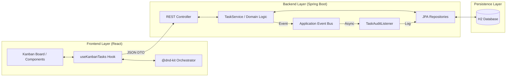
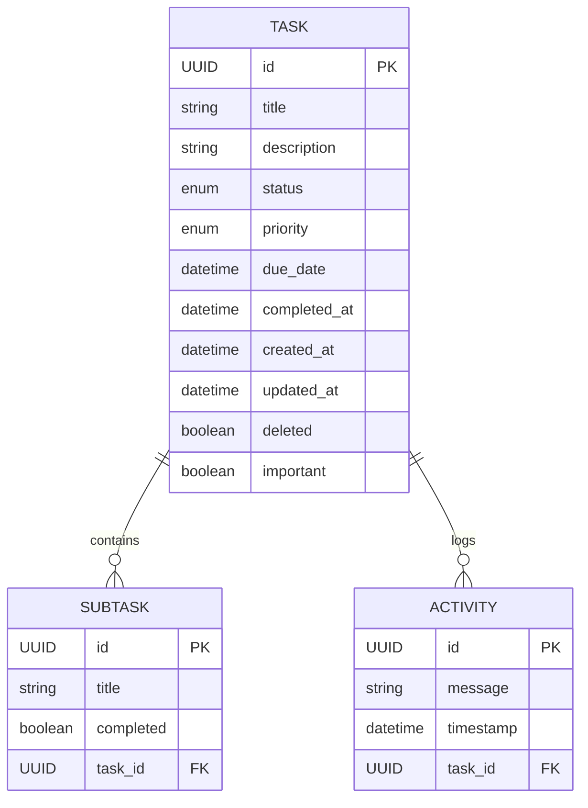

# Technical Architecture & System Specification

This document provides a detailed technical overview of the "To Do GP" system, covering its architectural patterns, data models, and operational infrastructure.

## 🏛️ System Components

The application follows a decoupled distributed architecture, separating the stateful backend from the reactive, stateless frontend.

## 🧬 Data Model (ER Diagram)

The persistence layer uses Hibernate/JPA to manage relations between the core `Task` entity and its associated telemetry (Subtasks and Activities).

## ⚙️ Core Technical Patterns

### 1. Asynchronous Event-Driven Auditing
The system handles auditing requirements without blocking primary business transactions through an asynchronous event pattern.

- **Implementation**:
  1. `TaskService` publishes a `TaskAuditEvent` upon successful state changes.
  2. The transaction completes and returns the response immediately.
  3. A `TaskAuditListener` (executing via `@Async`) calculates the field differential (diff).
  4. Modifications are persisted as `Activity` records in a separate execution thread.

### 2. Logical Deletion (Soft-Delete)
Data integrity and history retention are ensured via logical deletion flags.
- **Application**: `@SQLDelete` handles the transformation of `DELETE` commands into `UPDATE` operations.
- **Selection**: `@SQLRestriction` automatically filters deleted records in standard queries.
- **Recovery**: Native SQL bypasses allow for restoration of records when necessary.

### 3. Frontend State Orchestration
The UI implements **Optimistic Updates** to provide a zero-latency experience:
- **Interaction**: Local state updates immediately upon user action.
- **Synchronization**: Asynchronous requests synchronize the backend state.
- **Reconciliation**: State is rolled back automatically if the synchronization fails.

## 🛡️ Resilience & Observability

### 1. API Rate Limiting
A custom interceptor implements a frequency-based request counter to protect backend resources.
- **Mechanism**: Fixed-window counter per Client IP.
- **Threshold**: 60 requests per minute.
- **Outcome**: Returns `429 Too Many Requests` when limits are exceeded.

### 2. Business KPI Monitoring (Micrometer)
The application exposes business-centric metrics via the `/actuator/metrics` endpoint:
- `tasks.created`: Total workload generation count.
- `tasks.completed`: Throughput of finalized tasks.
- `tasks.deleted`: Tracking of system record attrition.

### 3. Environment Health Checks
Custom `HealthIndicator` implementations verify not just connectivity, but data-centric business health (e.g., monitoring the ratio of overdue tasks).

## 🐳 Production Infrastructure

The Containerized environment is configured for stability and automated health verification.

- **Dependency Management**: The UI container strictly waits for the API container to report a `healthy` status before initializing.
- **Persistence**: H2 database remains file-based and mounted via volumes for data durability.
- **Orchestration**: `docker-compose.yml` integrates with Spring Actuator for automated container lifecycle management.

---
Technical documentation maintained by Wilque Messias.
