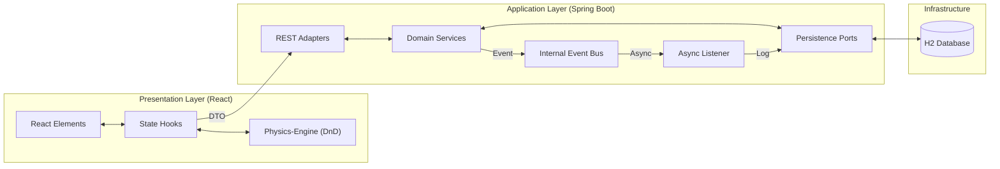
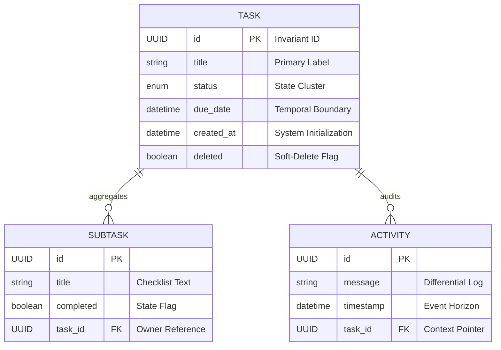

# Technical Architecture Specification

<div align="center">

**[English version](ARCHITECTURE.md)** | **[Versão em Português](ARCHITECTURE.pt-BR.md)**

</div>

---

## 🏛️ System Topology

The system is architected as a **Distributed Monolith**, emphasizing component boundary isolation between the presentation layer and the domain core. Synchronization is established via a RESTful strictly-typed interface.



---

## 🧬 Data Schema & Cardinality

Persistence is orchestrated via JPA/Hibernate, implementing one-to-many cardinality for telemetry aggregates (Tasks to Subtasks/Activities).



---

## ⚙️ Core Engineering Patterns

### 1. Asynchronous Auditing (Non-Blocking)
To decouple business throughput from side-effect latency, we implement an asynchronous event-driven audit trail.
1. **Emit**: `TaskService` publishes a `TaskAuditEvent` upon successful state changes.
2. **Handle**: A background thread calculates the field-level differential (diff).
3. **Commit**: The audit log is persisted in a separate database transaction, ensuring the user response is delivered immediately.

### 2. Resilience Design (Rate Limiting)
Protecting the API topology via a custom **RateLimitInterceptor**.
- **Mechanism**: Fixed-Window Counter calculated per Client IP address.
- **Fail-fast**: Automated `429 Too Many Requests` responses when limits are exceeded, safeguarding backend resources.

### 3. Observability & SLI Monitoring
Integration with **Micrometer** for exposing Service Level Indicators.
- **KPI Metrics**: Real-time tracking of `tasks.created` and `tasks.completed`.
- **Health Telemetry**: Specialized health probes monitoring business-critical data ratios (e.g., overdue tasks).

---

## 🐳 Infrastructure Orchestration

The deployment lifecycle is managed via **Docker Compose**, utilizing health-check dependencies to ensure stable service ignition.
- **Performance**: The UI is served via an optimized Nginx alpine container.
- **Stability**: Condition-based startup ensures the UI only initializes after the API reporting a `healthy` status.

---

## ✅ Prerequisites & Execution

- **Java 17** (Spring Boot)
- **Node 18** (Frontend)
- **Docker + Docker Compose** (recommended execution)

**Quick run (Docker Compose):**
```bash
docker-compose up -d --build
```
- **Interface**: [http://localhost](http://localhost)
- **Swagger**: [http://localhost:8080/swagger-ui.html](http://localhost:8080/swagger-ui.html)

---

## ⚖️ Decisions & Trade-offs

- **Distributed Monolith**: reduces coupling between layers without microservices overhead.
- **Asynchronous auditing**: improves perceived latency with eventual consistency in the log.
- **Rate limiting at API edge**: immediate protection with IP-based heuristics.

---

## 🚧 Known Limitations

- **In-memory H2**: suitable for development, not recommended for production.
- **IP-based rate limit**: not precise under NAT/Proxy scenarios.

---

## 🧭 Next Steps

- External persistence (PostgreSQL) with migrations (Flyway).
- Distributed tracing (OpenTelemetry) and advanced metrics.
- Rate limit policy per token/user.

---
Technical Architecture by Wilque Messias © 2026.
