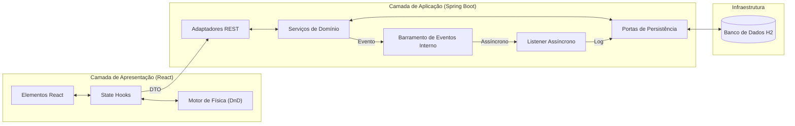
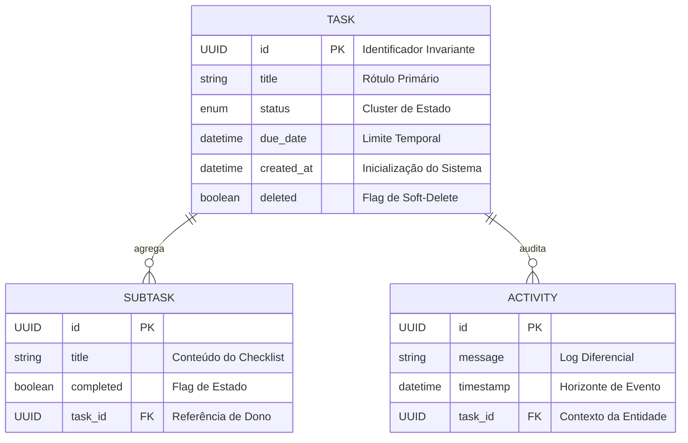
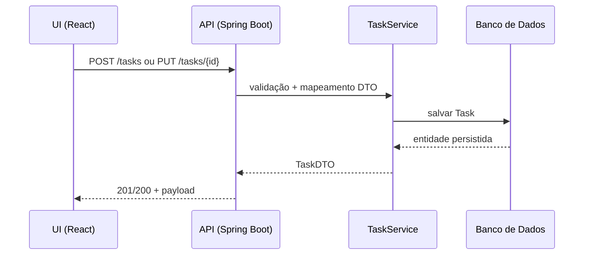
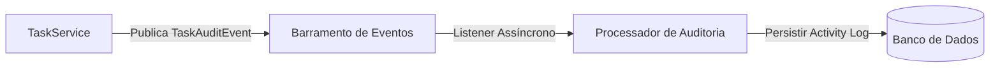
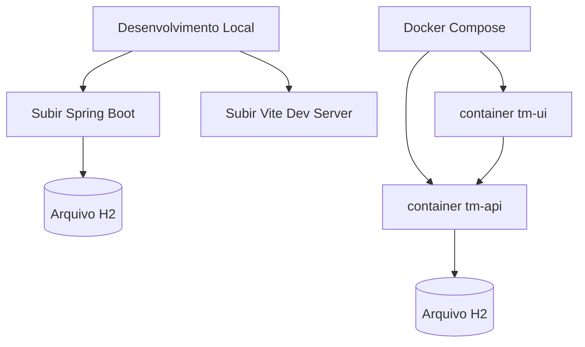

# Especificação Técnica de Arquitetura

<div align="center">

**[English version](ARCHITECTURE.md)** | **[Versão em Português](ARCHITECTURE.pt-BR.md)**

</div>

---

## Topologia do Sistema

O sistema é arquitetado como um **Monolito Distribuído**, enfatizando o isolamento de limites de componentes entre a camada de apresentação e o núcleo do domínio. A sincronização é estabelecida via uma interface RESTful estritamente tipada.



---

## Esquema de Dados & Cardinalidade

A persistência é gerenciada via JPA/Hibernate, utilizando cardinalidade um-para-muitos para telemetria de sub-entidades (Tarefas para Subtarefas/Atividades).



---

## Ciclo de Requisição (Create/Update)



---

## Fluxo de Auditoria (Assíncrono)



---

## Fluxo de Execução (Dev vs Prod)



---

## Padrões de Engenharia Core

### 1. Auditoria Assíncrona (Não-Bloqueante)
Para desacoplar a vazão de negócios da latência de efeitos colaterais, implementamos uma trilha de auditoria assíncrona orientada a eventos.
1. **Emissão**: o `TaskService` publica um `TaskAuditEvent` após mudanças de estado bem-sucedidas.
2. **Processamento**: Uma thread secundária calcula o diferencial de campos (diff).
3. **Persistência**: O log de auditoria é persistido em uma transação separada para não bloquear a resposta ao usuário.

### 2. Design de Resiliência (Rate Limiting)
Proteção da topologia da API através de um **RateLimitInterceptor** customizado.
- **Mecanismo**: Contador de Janela Fixa calculado por endereço IP do cliente.
- **Proteção**: Respostas automáticas `429 Too Many Requests` quando os limites são excedidos para proteger os recursos do backend.

### 3. Observabilidade & Monitoramento de SLI
Integração com **Micrometer** para exposição de Indicadores de Nível de Serviço.
- **Métricas KPI**: rastreamento em tempo real de `tasks.created` e `tasks.completed`.
- **Telemetria de Saúde**: Sondagens de saúde especializadas que monitoram proporções críticas de dados (ex: tarefas atrasadas).

---

## Orquestração de Infraestrutura

O ciclo de vida de implantação é gerenciado via **Docker Compose**, utilizando dependências de verificação de saúde para garantir a inicialização estável dos serviços.
- **Performance**: A UI é servida através de um container Nginx alpine.
- **Estabilidade**: A inicialização baseada em condições garante que a UI só inicie após a API reportar status `healthy`.

---

## Pré-requisitos & Execução

- **Java 17** (Spring Boot)
- **Node 18** (Frontend)
- **Docker + Docker Compose** (execução recomendada)

**Execução rápida (Launchers Automatizados):**
- **Windows**: `start.bat`
- **Linux/Mac**: `start.sh`

Os launchers verificam automaticamente o ambiente Docker e orquestram o build.

**Execução manual:**
```bash
docker compose up -d --build
```
- **Interface**: [http://localhost](http://localhost)
- **Swagger**: [http://localhost:8080/swagger-ui.html](http://localhost:8080/swagger-ui.html)

---

## Decisões & Trade-offs

- **Monolito Distribuído**: reduz acoplamento entre camadas sem incorrer em overhead de microserviços.
- **Auditoria assíncrona**: reduz latência de resposta, com eventual consistência no log.
- **Rate limiting no edge da API**: proteção com limite por IP como heurística simples.

---

## Limitações Conhecidas

- **Arquivo H2**: adequado para desenvolvimento, não recomendado para produção.
- **Rate limit por IP**: não cobre cenários de NAT/Proxy com precisão fina.

---

## Próximos Passos

- Persistência externa (PostgreSQL) com migrações (Flyway).
- Tracing distribuído (OpenTelemetry) e métricas avançadas.
- Política de rate limit por token/usuário.

---
Arquitetura Técnica por Wilque Messias © 2026.
