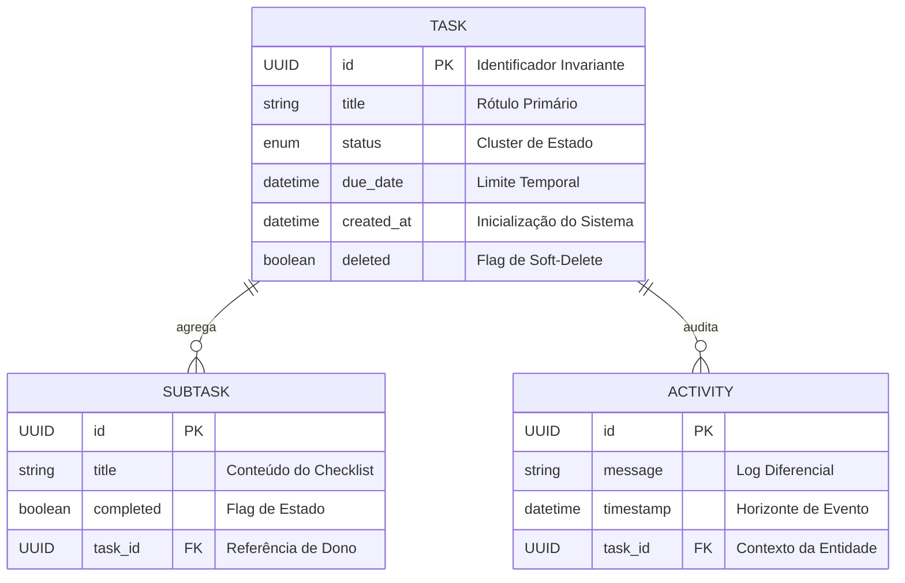

# Especificação Técnica de Arquitetura

**[English version](ARCHITECTURE.md)** | **[Versão em Português](README.pt-BR.md)**

---

## 🏛️ Topologia do Sistema

O sistema é arquitetado como um **Monolito Distribuído**, enfatizando o isolamento de limites de componentes entre a camada de apresentação e o núcleo do domínio. A sincronização é estabelecida via uma interface RESTful estritamente tipada.

---

## 🧬 Esquema de Dados & Cardinalidade

A persistência é gerenciada via JPA/Hibernate, utilizando cardinalidade um-para-muitos para telemetria de sub-entidades (Tarefas para Subtarefas/Atividades).

---

## ⚙️ Padrões de Engenharia Core

### 1. Auditoria Assíncrona (Não-Bloqueante)
Para desacoplar a vazão de negócios da latência de efeitos colaterais, implementamos uma trilha de auditoria assíncrona orientada a eventos.
1. **Emissão**: o `TaskService` publica um `TaskAuditEvent` após mudanças de estado bem-sucedidas.
2. **Processamento**: Uma thread secundária calcula o diferencial de campos (diff).
3. **Persistência**: O log de auditoria é persistido em uma transação de banco de dados separada, garantindo que a resposta ao usuário seja entregue imediatamente.

### 2. Design de Resiliência (Rate Limiting)
Proteção da topologia da API através de um **RateLimitInterceptor** customizado.
- **Mecanismo**: Contador de Janela Fixa calculado por endereço IP do cliente.
- **Proteção**: Respostas automáticas `429 Too Many Requests` quando os limites são excedidos, salvaguardando os recursos do backend.

### 3. Observabilidade & Monitoramento de SLI
Integração com **Micrometer** para exposição de Indicadores de Nível de Serviço.
- **Métricas KPI**: rastreamento em tempo real de `tasks.created` e `tasks.completed`.
- **Telemetria de Saúde**: Sondagens de saúde especializadas que monitoram proporções críticas de dados (ex: tarefas atrasadas).

---

## 🐳 Orquestração de Infraestrutura

O ciclo de vida de implantação é gerenciado via **Docker Compose**, utilizando dependências de verificação de saúde para garantir a inicialização estável dos serviços.
- **Performance**: A UI é servida através de um container Nginx alpine otimizado.
- **Estabilidade**: A inicialização baseada em condições garante que a UI só inicie após a API reportar status `healthy`.

---
Arquitetura Técnica por Wilque Messias © 2026.
